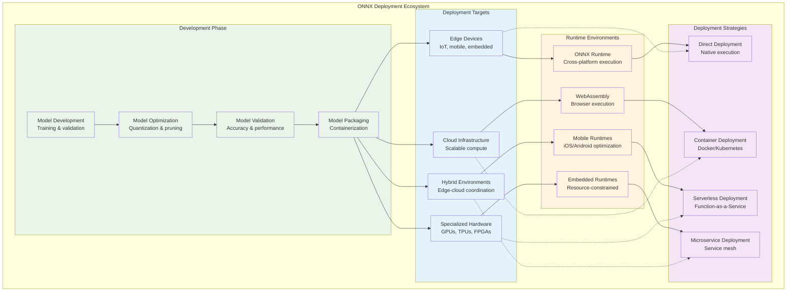
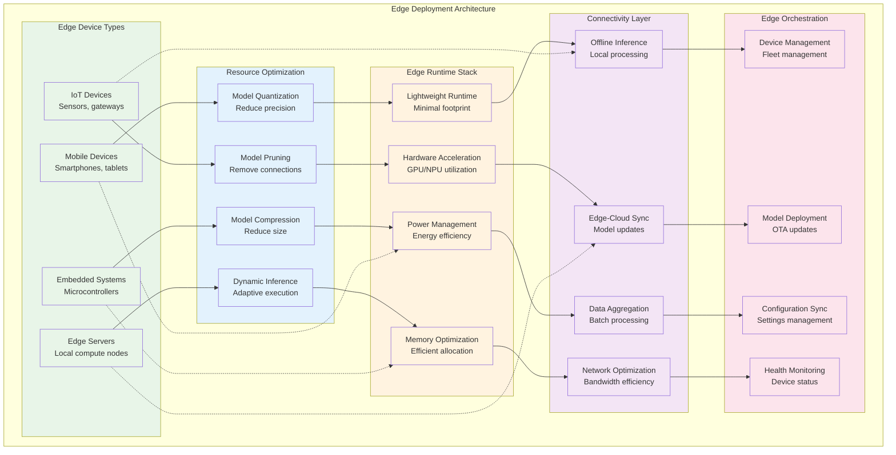
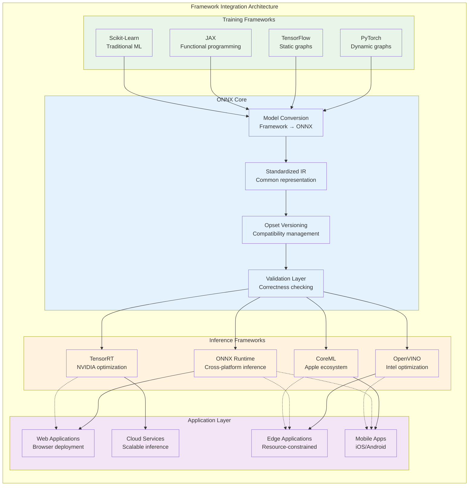
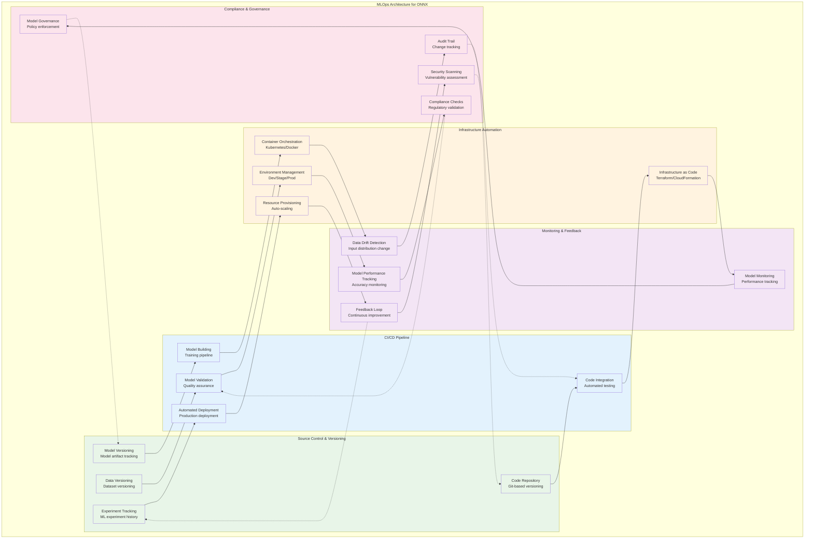

<!--
Copyright (c) ONNX Project Contributors

SPDX-License-Identifier: Apache-2.0
-->

# ONNX Deployment and Integration Architecture

This document provides comprehensive architecture diagrams for ONNX model deployment, framework integration, cloud deployment patterns, and production optimization strategies.

## Deployment Architecture Overview

ONNX enables flexible deployment across diverse environments from edge devices to cloud infrastructure.

## Cloud Deployment Architecture

Comprehensive cloud deployment patterns for scalable ONNX model serving.

```mermaid
graph TB
    subgraph CloudDeployment["Cloud Deployment Architecture"]
        subgraph LoadBalancingTier["Load Balancing Tier"]
            GlobalLoadBalancer["Global Load Balancer<br/>Traffic distribution"]
            RegionalLoadBalancer["Regional Load Balancer<br/>Geographic routing"]
            ApplicationLoadBalancer["Application Load Balancer<br/>Service routing"]
        end
        
        subgraph APIGateway["API Gateway Layer"]
            APIManagement["API Management<br/>Request routing"]
            Authentication["Authentication<br/>Security validation"]
            RateLimiting["Rate Limiting<br/>Traffic control"]
            RequestValidation["Request Validation<br/>Input validation"]
        end
        
        subgraph ModelServingCluster["Model Serving Cluster"]
            InferenceService1["Inference Service 1<br/>Model A deployment"]
            InferenceService2["Inference Service 2<br/>Model B deployment"]
            InferenceService3["Inference Service 3<br/>Model C deployment"]
            AutoScaler["Auto Scaler<br/>Dynamic scaling"]
        end
        
        subgraph SupportingServices["Supporting Services"]
            ModelRegistry["Model Registry<br/>Model versioning"]
            MetricsCollector["Metrics Collector<br/>Performance monitoring"]
            LoggingService["Logging Service<br/>Centralized logging"]
            ConfigService["Config Service<br/>Configuration management"]
        end
        
        subgraph DataLayer["Data Layer"]
            InputCache["Input Cache<br/>Request caching"]
            ResultCache["Result Cache<br/>Response caching"]
            ModelStorage["Model Storage<br/>Model artifacts"]
            DatabaseCluster["Database Cluster<br/>Metadata storage"]
        end
        
        subgraph MonitoringObservability["Monitoring & Observability"]
            PerformanceMonitoring["Performance Monitoring<br/>Real-time metrics"]
            AlertingSystem["Alerting System<br/>Incident management"]
            DistributedTracing["Distributed Tracing<br/>Request tracking"]
            HealthChecks["Health Checks<br/>Service availability"]
        end
    end
    
    GlobalLoadBalancer --> RegionalLoadBalancer
    RegionalLoadBalancer --> ApplicationLoadBalancer
    ApplicationLoadBalancer --> APIManagement
    
    APIManagement --> Authentication
    Authentication --> RateLimiting
    RateLimiting --> RequestValidation
    
    RequestValidation --> InferenceService1
    RequestValidation --> InferenceService2
    RequestValidation --> InferenceService3
    
    AutoScaler --> InferenceService1
    AutoScaler --> InferenceService2
    AutoScaler --> InferenceService3
    
    InferenceService1 --> ModelRegistry
    InferenceService2 --> ModelRegistry
    InferenceService3 --> ModelRegistry
    
    ModelRegistry --> ModelStorage
    InferenceService1 --> InputCache
    InferenceService2 --> ResultCache
    ConfigService --> DatabaseCluster
    
    InferenceService1 --> MetricsCollector
    InferenceService2 --> MetricsCollector
    InferenceService3 --> MetricsCollector
    
    MetricsCollector --> PerformanceMonitoring
    LoggingService --> AlertingSystem
    APIManagement --> DistributedTracing
    AutoScaler --> HealthChecks
    
    %% Styling
    classDef loadbalancing fill:#e8f5e8
    classDef gateway fill:#e3f2fd
    classDef serving fill:#fff3e0
    classDef supporting fill:#f3e5f5
    classDef data fill:#fce4ec
    classDef monitoring fill:#e8f4f8
    
    class GlobalLoadBalancer,RegionalLoadBalancer,ApplicationLoadBalancer,LoadBalancingTier loadbalancing
    class APIManagement,Authentication,RateLimiting,RequestValidation,APIGateway gateway
    class InferenceService1,InferenceService2,InferenceService3,AutoScaler,ModelServingCluster serving
    class ModelRegistry,MetricsCollector,LoggingService,ConfigService,SupportingServices supporting
    class InputCache,ResultCache,ModelStorage,DatabaseCluster,DataLayer data
    class PerformanceMonitoring,AlertingSystem,DistributedTracing,HealthChecks,MonitoringObservability monitoring
```

## Edge Deployment Architecture

Architecture for deploying ONNX models on edge devices with resource constraints.

## Framework Integration Patterns

Architecture for integrating ONNX with various ML frameworks and development ecosystems.

## Model Lifecycle Management

Comprehensive architecture for managing ONNX models throughout their lifecycle.

```mermaid
stateDiagram-v2
    [*] --> Development
    
    Development --> Training : Model design complete
    Training --> Validation : Training complete
    Validation --> Optimization : Validation passed
    Optimization --> Testing : Optimization complete
    Testing --> Staging : Tests passed
    Staging --> Production : Staging validated
    Production --> Monitoring : Deployed
    
    Validation --> Development : Validation failed
    Testing --> Optimization : Tests failed
    Staging --> Testing : Staging issues
    
    Monitoring --> UpdateRequired : Performance degradation
    UpdateRequired --> Development : New requirements
    UpdateRequired --> Optimization : Performance tuning
    UpdateRequired --> Retired : End of life
    
    Production --> Rollback : Critical issues
    Rollback --> Staging : Emergency rollback
    
    Retired --> [*]
    
    state Development {
        [*] --> ModelDesign
        ModelDesign --> DataPreparation
        DataPreparation --> FeatureEngineering
        FeatureEngineering --> [*]
    }
    
    state Training {
        [*] --> ModelTraining
        ModelTraining --> HyperparameterTuning
        HyperparameterTuning --> ModelSelection
        ModelSelection --> [*]
    }
    
    state Validation {
        [*] --> AccuracyValidation
        AccuracyValidation --> PerformanceValidation
        PerformanceValidation --> ComplianceValidation
        ComplianceValidation --> [*]
    }
    
    state Optimization {
        [*] --> Quantization
        Quantization --> Pruning
        Pruning --> GraphOptimization
        GraphOptimization --> [*]
    }
    
    state Testing {
        [*] --> UnitTesting
        UnitTesting --> IntegrationTesting
        IntegrationTesting --> PerformanceTesting
        PerformanceTesting --> [*]
    }
    
    state Staging {
        [*] --> StagingDeployment
        StagingDeployment --> LoadTesting
        LoadTesting --> UserAcceptanceTesting
        UserAcceptanceTesting --> [*]
    }
    
    state Production {
        [*] --> ProductionDeployment
        ProductionDeployment --> HealthChecks
        HealthChecks --> PerformanceMonitoring
        PerformanceMonitoring --> [*]
    }
    
    state Monitoring {
        [*] --> MetricsCollection
        MetricsCollection --> AnomalyDetection
        AnomalyDetection --> AlertGeneration
        AlertGeneration --> [*]
    }
```

## DevOps and CI/CD Integration

Architecture for integrating ONNX model development with DevOps practices and CI/CD pipelines.

## Summary

This deployment and integration architecture documentation provides comprehensive coverage of:

1. **Deployment Ecosystem**: Flexible deployment across edge, cloud, and hybrid environments
2. **Cloud Deployment**: Scalable cloud deployment patterns with load balancing and auto-scaling
3. **Edge Deployment**: Resource-optimized deployment for constrained edge environments
4. **Framework Integration**: Seamless integration with training and inference frameworks
5. **Model Lifecycle Management**: Complete lifecycle management from development to retirement
6. **MLOps Integration**: DevOps practices and CI/CD integration for production ML workflows

These architectures enable robust, scalable, and maintainable deployment of ONNX models across diverse environments while supporting modern DevOps practices and ensuring production reliability.