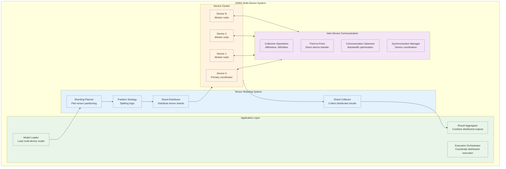
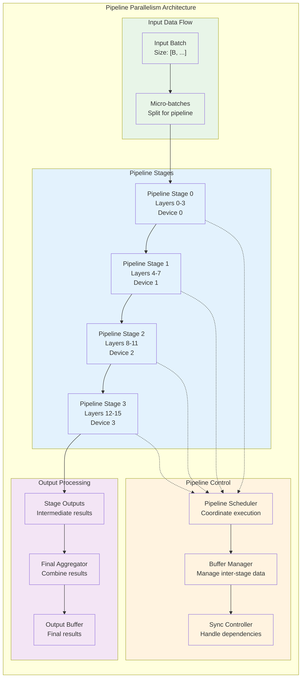
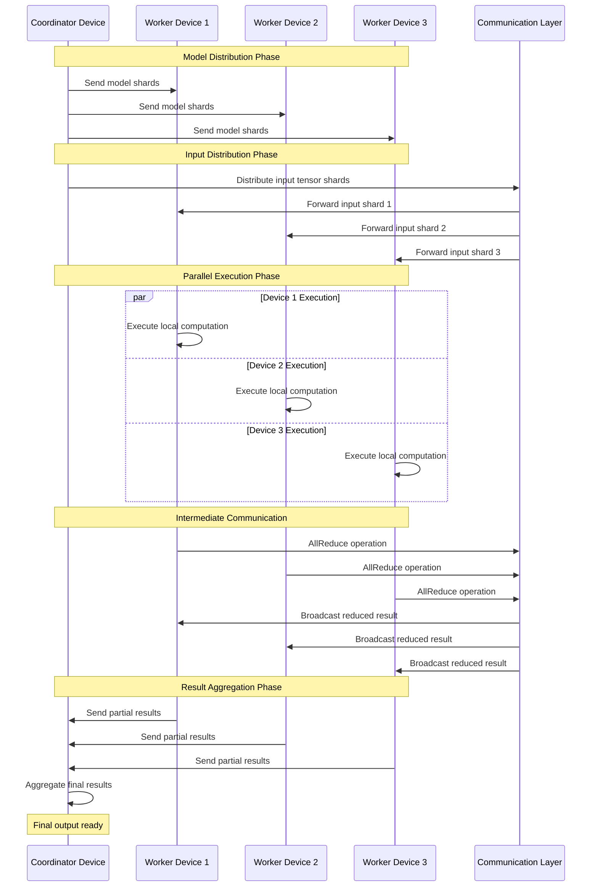
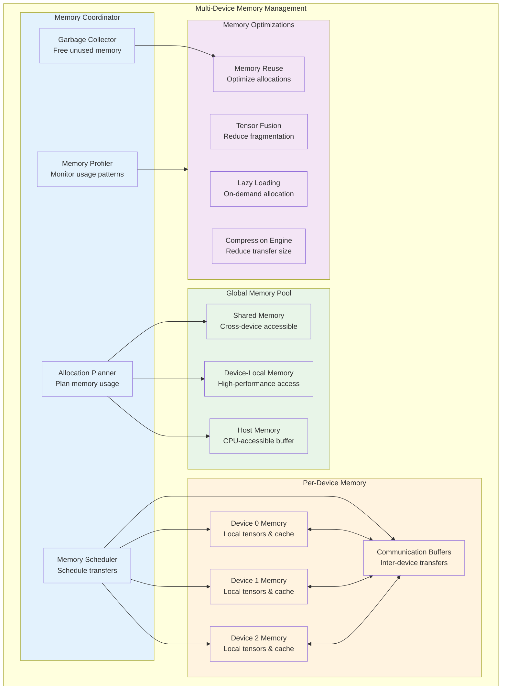
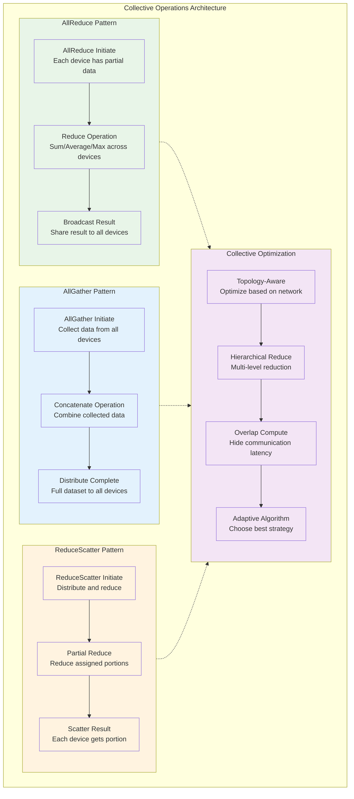

<!--
Copyright (c) ONNX Project Contributors

SPDX-License-Identifier: Apache-2.0
-->

# ONNX Multi-Device and Distributed Architecture

This document provides comprehensive architecture diagrams for ONNX multi-device execution, distributed inference, and parallel computation patterns.

## Multi-Device Execution Overview

ONNX supports distributed execution across multiple devices through tensor sharding, pipeline parallelism, and coordinated execution patterns.

## Tensor Sharding Architecture

The tensor sharding system enables distributing large tensors across multiple devices efficiently.

```mermaid
graph TB
    subgraph TensorSharding["Tensor Sharding Architecture"]
        subgraph InputTensor["Input Tensor Processing"]
            OriginalTensor["Original Tensor<br/>Shape: [B, S, H]"]
            ShardingSpec["Sharding Specification<br/>Axis and device mapping"]
            ShardingValidator["Sharding Validator<br/>Validate shard compatibility"]
        end
        
        subgraph ShardingTypes["Sharding Types"]
            AxisSplitting["Axis Splitting<br/>Split along dimension"]
            Replication["Replication<br/>Copy to all devices"]
            PartialSharding["Partial Sharding<br/>Mixed strategy"]
        end
        
        subgraph ShardDistribution["Shard Distribution"]
            Device0Shard["Device 0<br/>Shard [0:B/2, S, H]"]
            Device1Shard["Device 1<br/>Shard [B/2:B, S, H]"]
            Device2Shard["Device 2<br/>Replicated [B, S, H]"]
            DeviceNShard["Device N<br/>Custom shard"]
        end
        
        subgraph ReassemblyLogic["Tensor Reassembly"]
            ShardTracker["Shard Tracker<br/>Track shard locations"]
            ConcatenationLogic["Concatenation Logic<br/>Reconstruct tensor"]
            ConsistencyChecker["Consistency Checker<br/>Validate reconstruction"]
        end
    end
    
    OriginalTensor --> ShardingSpec
    ShardingSpec --> ShardingValidator
    ShardingValidator --> ShardingTypes
    
    AxisSplitting --> Device0Shard
    AxisSplitting --> Device1Shard
    Replication --> Device2Shard
    PartialSharding --> DeviceNShard
    
    Device0Shard --> ShardTracker
    Device1Shard --> ShardTracker
    Device2Shard --> ShardTracker
    DeviceNShard --> ShardTracker
    
    ShardTracker --> ConcatenationLogic
    ConcatenationLogic --> ConsistencyChecker
    
    %% Styling
    classDef input fill:#e8f5e8
    classDef types fill:#e3f2fd
    classDef distribution fill:#fff3e0
    classDef reassembly fill:#f3e5f5
    
    class OriginalTensor,ShardingSpec,ShardingValidator,InputTensor input
    class AxisSplitting,Replication,PartialSharding,ShardingTypes types
    class Device0Shard,Device1Shard,Device2Shard,DeviceNShard,ShardDistribution distribution
    class ShardTracker,ConcatenationLogic,ConsistencyChecker,ReassemblyLogic reassembly
```

## Pipeline Parallelism Architecture

Pipeline parallelism enables distributing different parts of the model across devices for sequential execution.

## Communication Patterns

Inter-device communication patterns for distributed ONNX execution.

## Device Memory Management

Memory management strategies for multi-device ONNX execution.

## Collective Operations Architecture

Implementation of collective communication operations for distributed ONNX execution.

## Summary

This multi-device architecture documentation provides comprehensive coverage of:

1. **Multi-Device Execution**: Complete system for coordinated distributed processing
2. **Tensor Sharding**: Efficient strategies for distributing large tensors across devices
3. **Pipeline Parallelism**: Sequential processing across multiple devices for large models
4. **Communication Patterns**: Optimized inter-device communication protocols
5. **Memory Management**: Sophisticated memory coordination across devices
6. **Collective Operations**: Efficient implementation of distributed communication patterns

These diagrams enable developers to understand and implement distributed ONNX execution patterns, supporting large-scale model deployment and high-performance inference scenarios.