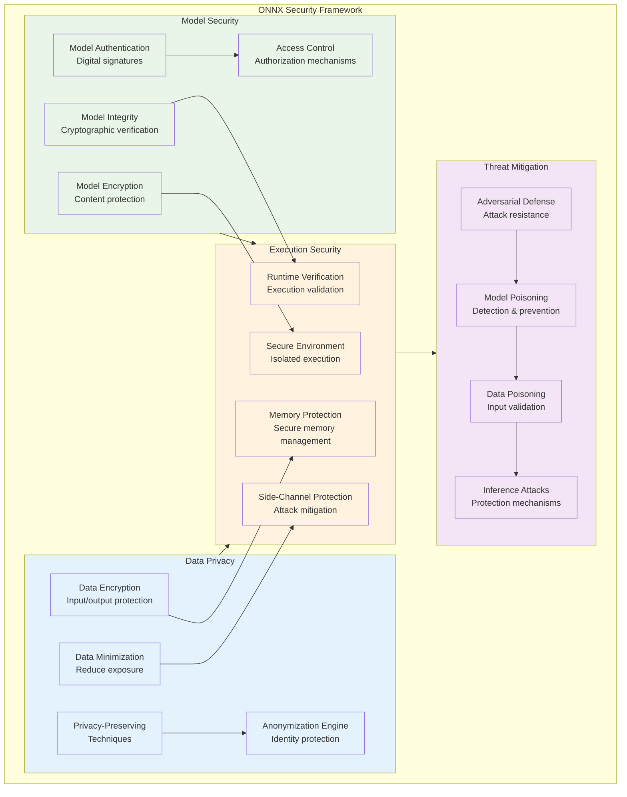
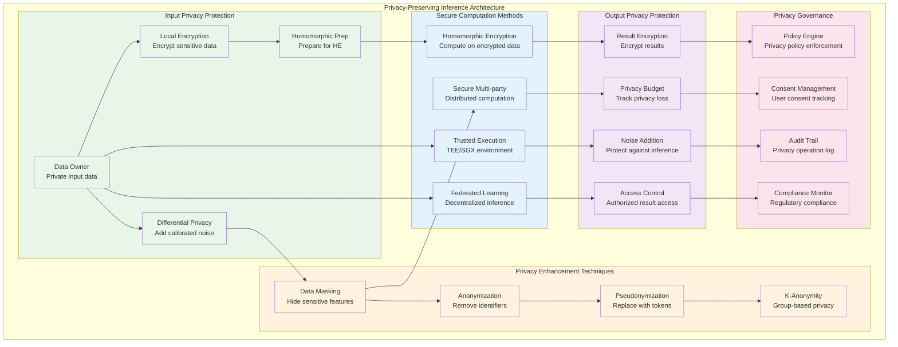
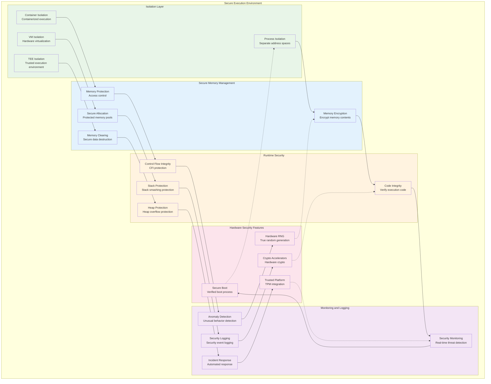
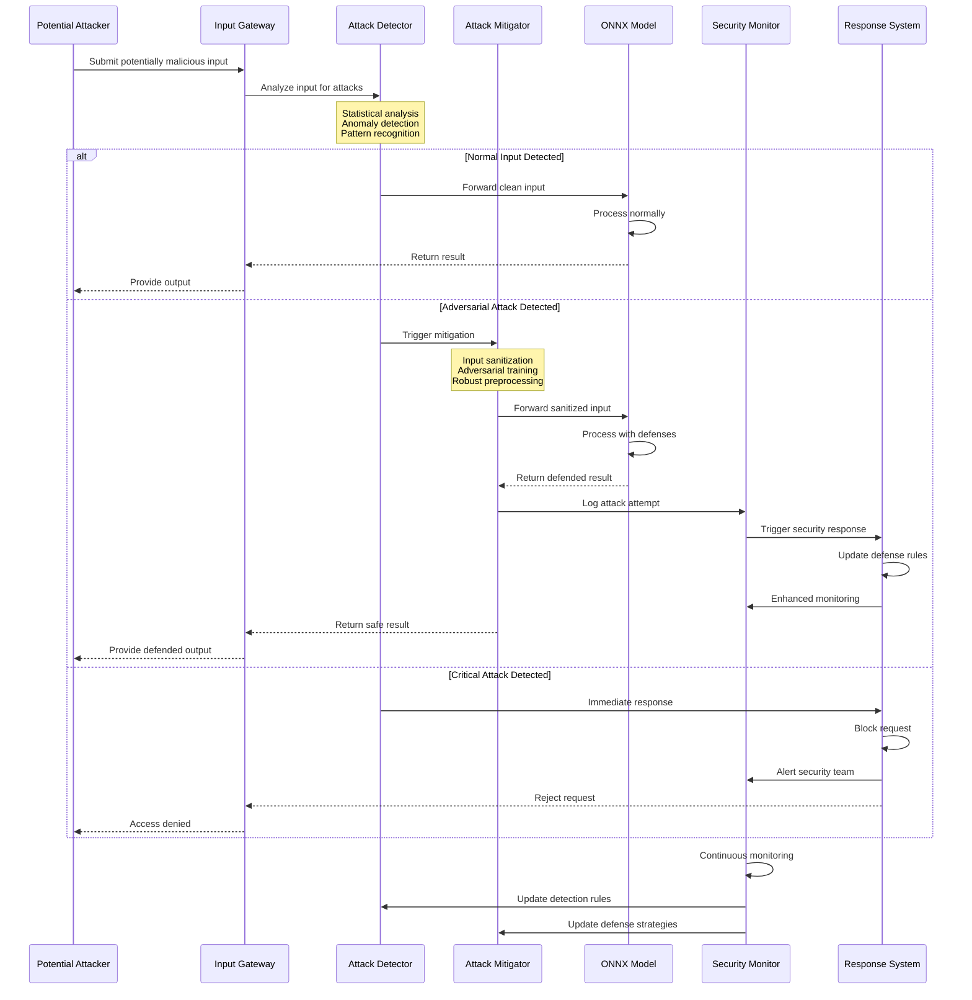
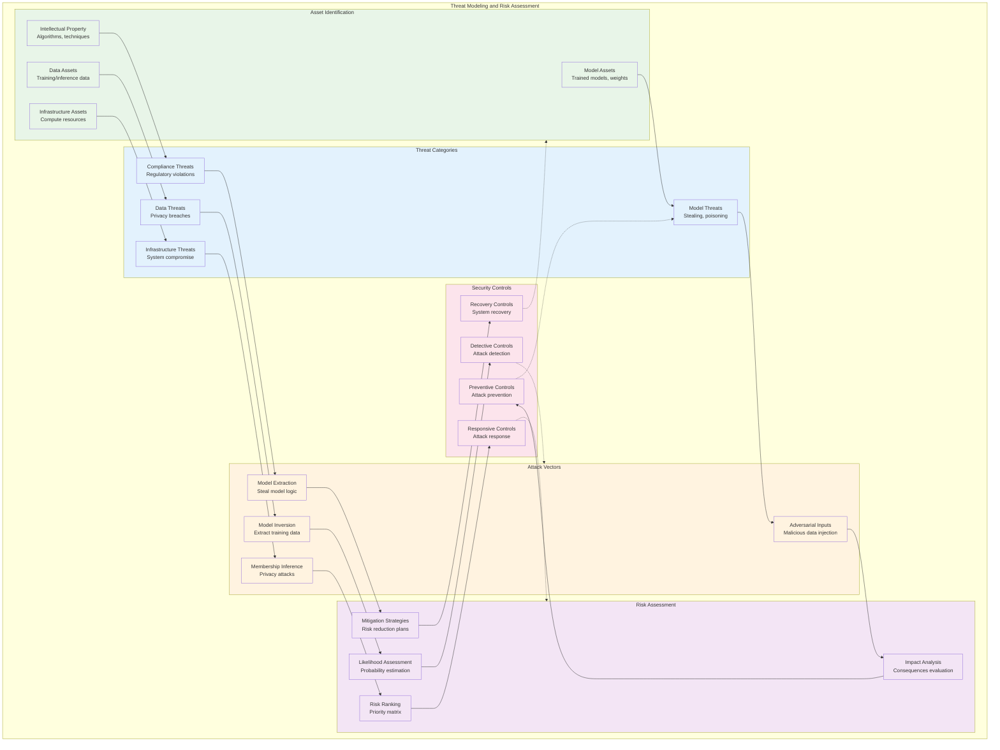

<!--
Copyright (c) ONNX Project Contributors

SPDX-License-Identifier: Apache-2.0
-->

# ONNX Security and Privacy Architecture

This document provides comprehensive architecture diagrams for ONNX security, privacy protection, model integrity, and secure deployment patterns.

## Security Framework Overview

ONNX security architecture encompasses model protection, data privacy, execution security, and secure distribution mechanisms.

## Model Integrity and Authentication

Architecture for ensuring ONNX model integrity, authenticity, and secure distribution.

```mermaid
graph TB
    subgraph ModelIntegritySystem["Model Integrity and Authentication System"]
        subgraph ModelCreation["Model Creation Phase"]
            ModelDeveloper["Model Developer<br/>Create/train model"]
            ModelSigning["Model Signing<br/>Apply digital signature"]
            HashGeneration["Hash Generation<br/>Compute model hash"]
            CertificateGeneration["Certificate Generation<br/>Create authenticity cert"]
        end
        
        subgraph CryptographicLayer["Cryptographic Layer"]
            DigitalSignatures["Digital Signatures<br/>RSA/ECDSA signing"]
            HashAlgorithms["Hash Algorithms<br/>SHA-256/SHA-3"]
            PublicKeyInfra["Public Key Infrastructure<br/>Certificate management"]
            CryptoValidation["Crypto Validation<br/>Signature verification"]
        end
        
        subgraph DistributionSecurity["Distribution Security"]
            SecureChannels["Secure Channels<br/>TLS/HTTPS transport"]
            ModelRepository["Model Repository<br/>Secure storage"]
            AccessControl["Access Control<br/>Authorization system"]
            AuditLogging["Audit Logging<br/>Access tracking"]
        end
        
        subgraph VerificationPhase["Verification Phase"]
            ModelLoader["Model Loader<br/>Load and verify"]
            IntegrityChecker["Integrity Checker<br/>Hash verification"]
            SignatureValidator["Signature Validator<br/>Authenticity check"]
            TrustEvaluator["Trust Evaluator<br/>Trust assessment"]
        end
        
        subgraph SecurityMetadata["Security Metadata"]
            ModelManifest["Model Manifest<br/>Security information"]
            ProvenanceRecord["Provenance Record<br/>Origin tracking"]
            SecurityPolicy["Security Policy<br/>Usage constraints"]
            ComplianceMarkers["Compliance Markers<br/>Regulatory info"]
        end
    end
    
    ModelDeveloper --> ModelSigning
    ModelSigning --> DigitalSignatures
    ModelSigning --> HashGeneration
    HashGeneration --> HashAlgorithms
    ModelSigning --> CertificateGeneration
    CertificateGeneration --> PublicKeyInfra
    
    DigitalSignatures --> SecureChannels
    PublicKeyInfra --> ModelRepository
    ModelRepository --> AccessControl
    AccessControl --> AuditLogging
    
    ModelRepository --> ModelLoader
    ModelLoader --> IntegrityChecker
    IntegrityChecker --> CryptoValidation
    IntegrityChecker --> SignatureValidator
    SignatureValidator --> TrustEvaluator
    
    ModelSigning --> ModelManifest
    ModelDeveloper --> ProvenanceRecord
    TrustEvaluator --> SecurityPolicy
    SecurityPolicy --> ComplianceMarkers
    
    %% Styling
    classDef creation fill:#e8f5e8
    classDef crypto fill:#e3f2fd
    classDef distribution fill:#fff3e0
    classDef verification fill:#f3e5f5
    classDef metadata fill:#fce4ec
    
    class ModelDeveloper,ModelSigning,HashGeneration,CertificateGeneration,ModelCreation creation
    class DigitalSignatures,HashAlgorithms,PublicKeyInfra,CryptoValidation,CryptographicLayer crypto
    class SecureChannels,ModelRepository,AccessControl,AuditLogging,DistributionSecurity distribution
    class ModelLoader,IntegrityChecker,SignatureValidator,TrustEvaluator,VerificationPhase verification
    class ModelManifest,ProvenanceRecord,SecurityPolicy,ComplianceMarkers,SecurityMetadata metadata
```

## Privacy-Preserving Inference

Architecture for privacy-preserving ONNX model inference protecting sensitive data.

## Secure Execution Environment

Architecture for secure ONNX model execution with isolation and protection mechanisms.

## Adversarial Attack Mitigation

Architecture for detecting and mitigating adversarial attacks against ONNX models.

## Threat Modeling and Risk Assessment

Comprehensive threat modeling architecture for ONNX security analysis.

## Summary

This security and privacy architecture documentation provides comprehensive coverage of:

1. **Security Framework**: Multi-layered security approach protecting models, data, and execution
2. **Model Integrity**: Cryptographic protection ensuring model authenticity and integrity
3. **Privacy-Preserving Inference**: Advanced techniques for protecting sensitive data during inference
4. **Secure Execution**: Isolated and protected execution environments with comprehensive monitoring
5. **Adversarial Defense**: Detection and mitigation of adversarial attacks against ONNX models
6. **Threat Modeling**: Systematic approach to identifying, assessing, and mitigating security risks

These architectures enable secure deployment and operation of ONNX models in production environments, addressing privacy concerns, regulatory compliance, and adversarial threats while maintaining performance and usability.