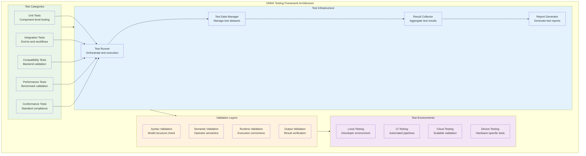
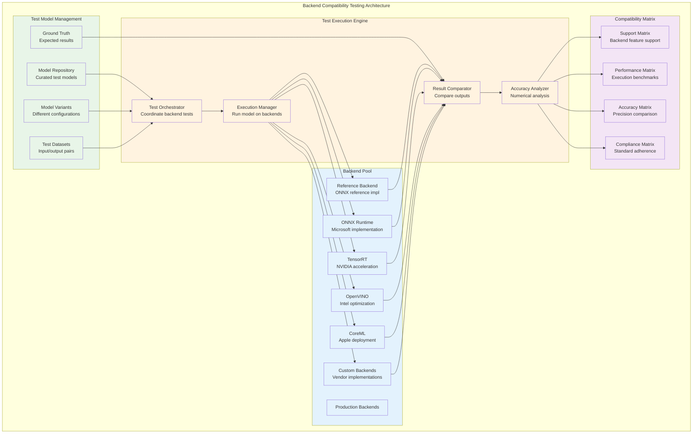
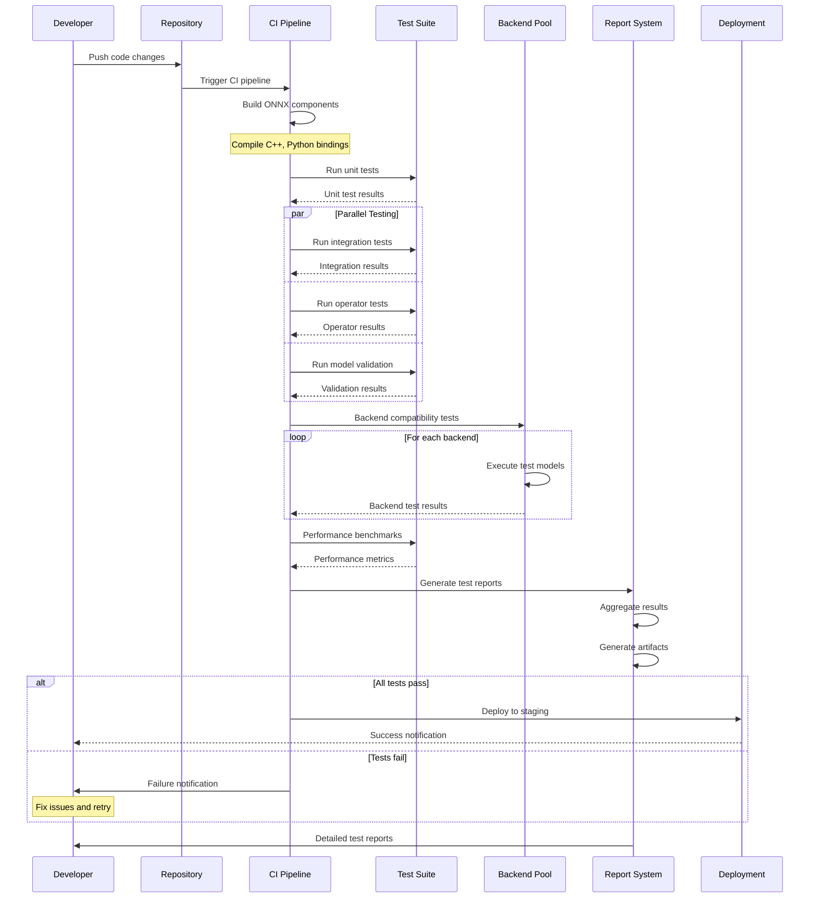
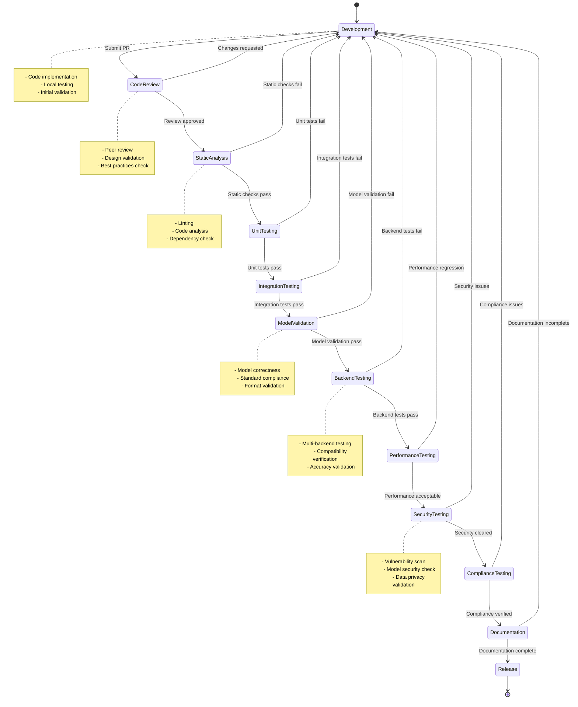

<!--
Copyright (c) ONNX Project Contributors

SPDX-License-Identifier: Apache-2.0
-->

# ONNX Testing and Validation Architecture

This document provides comprehensive architecture diagrams for ONNX testing, validation, quality assurance, and continuous integration patterns.

## Testing Framework Overview

ONNX employs a multi-layered testing architecture to ensure model correctness, performance, and compatibility across diverse backends.

## Model Validation Pipeline

Comprehensive validation pipeline for ONNX models ensuring correctness and compliance.

```mermaid
flowchart TD
    subgraph ValidationPipeline["Model Validation Pipeline"]
        subgraph InputStage["Input Stage"]
            ModelInput["ONNX Model Input<br/>.onnx file"]
            ModelParser["Model Parser<br/>Parse protobuf structure"]
            InitialValidation["Initial Validation<br/>Basic format check"]
        end
        
        subgraph StructuralValidation["Structural Validation"]
            GraphStructure["Graph Structure<br/>Validate node connections"]
            OperatorValidation["Operator Validation<br/>Check operator schemas"]
            TypeValidation["Type Validation<br/>Verify data types"]
            ShapeValidation["Shape Validation<br/>Validate tensor shapes"]
        end
        
        subgraph SemanticValidation["Semantic Validation"]
            DomainChecking["Domain Checking<br/>Verify operator domains"]
            OpsetValidation["Opset Validation<br/>Check version compatibility"]
            AttributeValidation["Attribute Validation<br/>Validate operator attributes"]
            ConstraintChecking["Constraint Checking<br/>Type and shape constraints"]
        end
        
        subgraph RuntimeValidation["Runtime Validation"]
            ExecutionTesting["Execution Testing<br/>Test model execution"]
            ReferenceComparison["Reference Comparison<br/>Compare with reference"]
            AccuracyValidation["Accuracy Validation<br/>Numerical precision check"]
            BackendCompatibility["Backend Compatibility<br/>Multi-backend testing"]
        end
        
        subgraph OutputStage["Output Stage"]
            ValidationReport["Validation Report<br/>Detailed results"]
            ErrorSummary["Error Summary<br/>Issues and warnings"]
            ComplianceCert["Compliance Certificate<br/>Validation passed"]
        end
    end
    
    ModelInput --> ModelParser
    ModelParser --> InitialValidation
    InitialValidation --> GraphStructure
    
    GraphStructure --> OperatorValidation
    OperatorValidation --> TypeValidation
    TypeValidation --> ShapeValidation
    
    ShapeValidation --> DomainChecking
    DomainChecking --> OpsetValidation
    OpsetValidation --> AttributeValidation
    AttributeValidation --> ConstraintChecking
    
    ConstraintChecking --> ExecutionTesting
    ExecutionTesting --> ReferenceComparison
    ReferenceComparison --> AccuracyValidation
    AccuracyValidation --> BackendCompatibility
    
    BackendCompatibility --> ValidationReport
    ValidationReport --> ErrorSummary
    ErrorSummary --> ComplianceCert
    
    %% Error flows
    GraphStructure -.-> ErrorSummary
    OperatorValidation -.-> ErrorSummary
    TypeValidation -.-> ErrorSummary
    ShapeValidation -.-> ErrorSummary
    DomainChecking -.-> ErrorSummary
    OpsetValidation -.-> ErrorSummary
    AttributeValidation -.-> ErrorSummary
    ConstraintChecking -.-> ErrorSummary
    ExecutionTesting -.-> ErrorSummary
    ReferenceComparison -.-> ErrorSummary
    AccuracyValidation -.-> ErrorSummary
    BackendCompatibility -.-> ErrorSummary
    
    %% Styling
    classDef input fill:#e8f5e8
    classDef structural fill:#e3f2fd
    classDef semantic fill:#fff3e0
    classDef runtime fill:#f3e5f5
    classDef output fill:#fce4ec
    
    class ModelInput,ModelParser,InitialValidation,InputStage input
    class GraphStructure,OperatorValidation,TypeValidation,ShapeValidation,StructuralValidation structural
    class DomainChecking,OpsetValidation,AttributeValidation,ConstraintChecking,SemanticValidation semantic
    class ExecutionTesting,ReferenceComparison,AccuracyValidation,BackendCompatibility,RuntimeValidation runtime
    class ValidationReport,ErrorSummary,ComplianceCert,OutputStage output
```

## Backend Compatibility Testing

Architecture for testing ONNX model compatibility across different backend implementations.

## Continuous Integration Testing

CI/CD pipeline architecture for automated ONNX testing and validation.

## Performance Testing Architecture

Comprehensive performance testing and benchmarking system for ONNX models and operations.

```mermaid
graph TB
    subgraph PerformanceTesting["Performance Testing Architecture"]
        subgraph BenchmarkSuite["Benchmark Suite"]
            ModelBenchmarks["Model Benchmarks<br/>End-to-end performance"]
            OperatorBenchmarks["Operator Benchmarks<br/>Individual op performance"]
            MemoryBenchmarks["Memory Benchmarks<br/>Memory usage patterns"]
            ThroughputBenchmarks["Throughput Benchmarks<br/>Batch processing"]
        end
        
        subgraph TestConfiguration["Test Configuration"]
            HardwareProfiles["Hardware Profiles<br/>Different device types"]
            ModelVariations["Model Variations<br/>Different sizes/types"]
            InputVariations["Input Variations<br/>Different batch sizes"]
            PrecisionModes["Precision Modes<br/>FP32, FP16, INT8"]
        end
        
        subgraph MetricsCollection["Metrics Collection"]
            LatencyProfiler["Latency Profiler<br/>Execution time"]
            ThroughputMeasurer["Throughput Measurer<br/>Operations per second"]
            MemoryProfiler["Memory Profiler<br/>Memory consumption"]
            PowerMonitor["Power Monitor<br/>Energy consumption"]
        end
        
        subgraph PerformanceAnalysis["Performance Analysis"]
            StatisticalAnalysis["Statistical Analysis<br/>Performance distribution"]
            RegressionDetection["Regression Detection<br/>Performance degradation"]
            ComparisonEngine["Comparison Engine<br/>Baseline comparison"]
            TrendAnalysis["Trend Analysis<br/>Historical performance"]
        end
        
        subgraph ReportingSystem["Reporting System"]
            PerformanceDashboard["Performance Dashboard<br/>Real-time metrics"]
            BenchmarkReports["Benchmark Reports<br/>Detailed analysis"]
            AlertSystem["Alert System<br/>Regression notifications"]
            ArchiveSystem["Archive System<br/>Historical data"]
        end
    end
    
    ModelBenchmarks --> HardwareProfiles
    OperatorBenchmarks --> ModelVariations
    MemoryBenchmarks --> InputVariations
    ThroughputBenchmarks --> PrecisionModes
    
    HardwareProfiles --> LatencyProfiler
    ModelVariations --> ThroughputMeasurer
    InputVariations --> MemoryProfiler
    PrecisionModes --> PowerMonitor
    
    LatencyProfiler --> StatisticalAnalysis
    ThroughputMeasurer --> RegressionDetection
    MemoryProfiler --> ComparisonEngine
    PowerMonitor --> TrendAnalysis
    
    StatisticalAnalysis --> PerformanceDashboard
    RegressionDetection --> BenchmarkReports
    ComparisonEngine --> AlertSystem
    TrendAnalysis --> ArchiveSystem
    
    %% Styling
    classDef benchmark fill:#e8f5e8
    classDef config fill:#e3f2fd
    classDef metrics fill:#fff3e0
    classDef analysis fill:#f3e5f5
    classDef reporting fill:#fce4ec
    
    class ModelBenchmarks,OperatorBenchmarks,MemoryBenchmarks,ThroughputBenchmarks,BenchmarkSuite benchmark
    class HardwareProfiles,ModelVariations,InputVariations,PrecisionModes,TestConfiguration config
    class LatencyProfiler,ThroughputMeasurer,MemoryProfiler,PowerMonitor,MetricsCollection metrics
    class StatisticalAnalysis,RegressionDetection,ComparisonEngine,TrendAnalysis,PerformanceAnalysis analysis
    class PerformanceDashboard,BenchmarkReports,AlertSystem,ArchiveSystem,ReportingSystem reporting
```

## Quality Assurance Workflow

Comprehensive quality assurance workflow ensuring ONNX ecosystem reliability and standards compliance.

## Summary

This testing and validation architecture documentation provides comprehensive coverage of:

1. **Testing Framework**: Multi-layered testing approach with comprehensive coverage
2. **Model Validation**: Systematic validation pipeline ensuring model correctness
3. **Backend Compatibility**: Cross-backend testing ensuring broad ecosystem support
4. **Continuous Integration**: Automated testing pipeline for continuous quality assurance
5. **Performance Testing**: Comprehensive benchmarking and performance monitoring
6. **Quality Assurance**: End-to-end workflow ensuring reliability and compliance

These architectures enable robust testing and validation of ONNX models, operators, and implementations across the entire ecosystem, ensuring high quality and reliability standards.